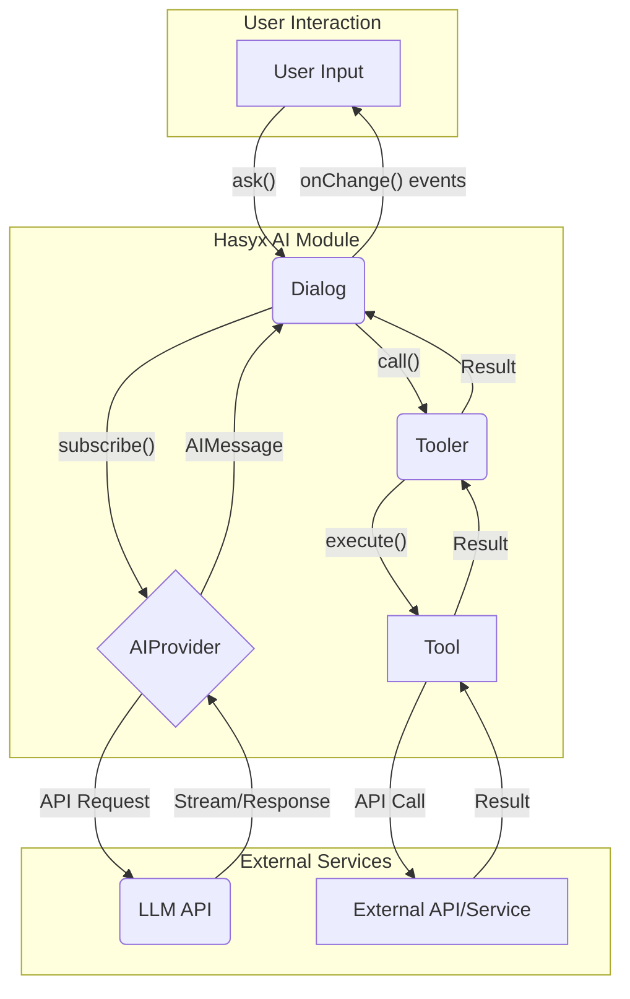

# AI Architecture

This document outlines the architecture of the Hasyx AI module, which is designed for robust, event-driven, and tool-augmented interactions with Large Language Models (LLMs).

## Core Components

The AI module is built around three core components:

1.  **`Dialog`**: The central orchestrator that manages the entire conversation lifecycle.
2.  **`AIProvider`**: An interface for LLM providers (like Ollama or OpenRouter) that handles the actual communication with the AI model.
3.  **`Tooler` & `Tool`**: A system for defining and executing external tools that the AI can use to perform actions.



## 1. Dialog Class

The `Dialog` class is the heart of the AI module. It manages the flow of a conversation, from receiving user input to processing AI responses and handling tool calls.

-   **Event-Driven**: `Dialog` does not return values directly. Instead, it emits a series of events through an `onChange` callback, providing granular insight into the conversation's state.
-   **State Management**: It maintains the conversation history and a queue of messages to be sent to the AI.
-   **Orchestration**: It coordinates interactions between the `AIProvider` and the `Tooler`.

### Usage

```typescript
import { Dialog } from './dialog';
import { OllamaProvider } from './providers/ollama';
import { TerminalTool } from './tools/terminal-tool';

const dialog = new Dialog({
  provider: new OllamaProvider({ model: 'gemma2:2b' }),
  tools: [new TerminalTool()],
  systemPrompt: 'You are a helpful assistant.',
  onChange: (event) => {
    console.log('[EVENT]', event.type, event);
  }
});

// Start a conversation
dialog.ask({ role: 'user', content: 'List files in the current directory.' });
```

### Dialog Events (`DialogEvent`)

The `onChange` callback receives events of the following types:

-   `ask`: A new message has been added to the processing queue.
-   `ai_request`: A request is being sent to the `AIProvider`.
-   `ai_chunk`: A chunk of a streaming response has been received.
-   `ai_response`: The full AI response has been collected.
-   `tool_call`: The AI has requested to use a tool.
-   `tool_log`: A tool has emitted a log message.
-   `tool_result`: A tool has finished execution and returned a result.
-   `done`: The current processing cycle is complete.
-   `error`: A critical error occurred.

## 2. AIProvider Interface

The `AIProvider` is a standardized interface for communicating with different LLM backends.

```typescript
export interface AIProvider {
  query(messages: AIMessage[], options?: ProviderOptions): Promise<AIMessage>;
  stream(messages: AIMessage[], options?: ProviderOptions): Promise<ReadableStream<string>>;
}
```

Hasyx includes two provider implementations:

-   **`OllamaProvider`**: For running models locally with [Ollama](https://ollama.ai/).
-   **`OpenRouterProvider`**: For accessing a wide range of cloud models via [OpenRouter](https://openrouter.ai/).

This design makes it easy to switch between local and cloud models or even add new providers.

## 3. Tooler and Tool Classes

This system allows the AI to perform actions in the real world.

-   **`Tool`**: An abstract class for creating custom tools. Each tool defines its `name`, a `contextPreprompt` (explaining to the AI how to use it), and an `execute` method.
-   **`Tooler`**: A class that manages a collection of `Tool` instances. It parses AI responses to find tool-call requests, validates them, and executes the appropriate tool.

### Tool Execution Flow

1.  The `Dialog` receives a response from the AI.
2.  It passes the response to the `Tooler`.
3.  The `Tooler` uses a regular expression to find any tool calls in the format `> 😈<uuid>/<tool_name>/<command>`.
4.  For each valid call, it invokes the `execute` method of the corresponding `Tool`.
5.  The result of the execution is sent back to the `Dialog`, which then formulates a new message for the AI, informing it of the tool's outcome.
